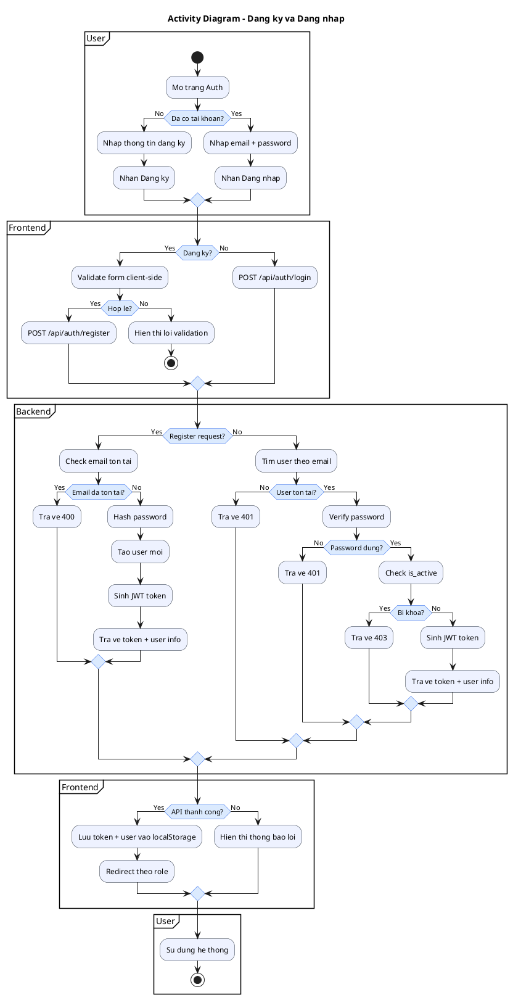
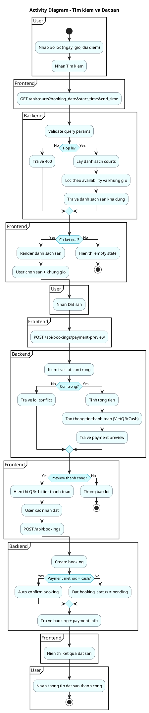
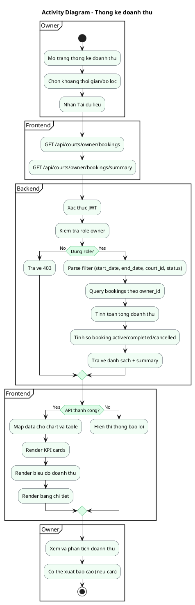

## Activity Diagram - Dang ky va Dang nhap

```plantuml
@startuml
skinparam shadowing false
skinparam activity {
  BorderColor #1f2937
  BackgroundColor #eef2ff
  DiamondBackgroundColor #dbeafe
  DiamondBorderColor #2563eb
}

title Activity Diagram - Dang ky va Dang nhap

partition User {
  start
  :Mo trang Auth;
  if (Da co tai khoan?) then (No)
    :Nhap thong tin dang ky;
    :Nhan Dang ky;
  else (Yes)
    :Nhap email + password;
    :Nhan Dang nhap;
  endif
}

partition Frontend {
  if (Dang ky?) then (Yes)
    :Validate form client-side;
    if (Hop le?) then (Yes)
      :POST /api/auth/register;
    else (No)
      :Hien thi loi validation;
      stop
    endif
  else (No)
    :POST /api/auth/login;
  endif
}

partition Backend {
  if (Register request?) then (Yes)
    :Check email ton tai;
    if (Email da ton tai?) then (Yes)
      :Tra ve 400;
    else (No)
      :Hash password;
      :Tao user moi;
      :Sinh JWT token;
      :Tra ve token + user info;
    endif
  else (No)
    :Tim user theo email;
    if (User ton tai?) then (No)
      :Tra ve 401;
    else (Yes)
      :Verify password;
      if (Password dung?) then (No)
        :Tra ve 401;
      else (Yes)
        :Check is_active;
        if (Bi khoa?) then (Yes)
          :Tra ve 403;
        else (No)
          :Sinh JWT token;
          :Tra ve token + user info;
        endif
      endif
    endif
  endif
}

partition Frontend {
  if (API thanh cong?) then (Yes)
    :Luu token + user vao localStorage;
    :Redirect theo role;
  else (No)
    :Hien thi thong bao loi;
  endif
}

partition User {
  :Su dung he thong;
  stop
}
@enduml
```

---

## Activity Diagram - Tim kiem va Dat san

```plantuml
@startuml
skinparam shadowing false
skinparam activity {
  BorderColor #1f2937
  BackgroundColor #ecfeff
  DiamondBackgroundColor #cffafe
  DiamondBorderColor #0891b2
}

title Activity Diagram - Tim kiem va Dat san

partition User {
  start
  :Nhap bo loc (ngay, gio, dia diem);
  :Nhan Tim kiem;
}

partition Frontend {
  :GET /api/courts?booking_date&start_time&end_time;
}

partition Backend {
  :Validate query params;
  if (Hop le?) then (No)
    :Tra ve 400;
  else (Yes)
    :Lay danh sach courts;
    :Loc theo availability va khung gio;
    :Tra ve danh sach san kha dung;
  endif
}

partition Frontend {
  if (Co ket qua?) then (Yes)
    :Render danh sach san;
    :User chon san + khung gio;
  else (No)
    :Hien thi empty state;
    stop
  endif
}

partition User {
  :Nhan Dat san;
}

partition Frontend {
  :POST /api/bookings/payment-preview;
}

partition Backend {
  :Kiem tra slot con trong;
  if (Con trong?) then (No)
    :Tra ve loi conflict;
  else (Yes)
    :Tinh tong tien;
    :Tao thong tin thanh toan (VietQR/Cash);
    :Tra ve payment preview;
  endif
}

partition Frontend {
  if (Preview thanh cong?) then (Yes)
    :Hien thi QR/chi tiet thanh toan;
    :User xac nhan dat;
    :POST /api/bookings;
  else (No)
    :Thong bao loi;
    stop
  endif
}

partition Backend {
  :Create booking;
  if (Payment method = cash?) then (Yes)
    :Auto confirm booking;
  else (No)
    :Dat booking_status = pending;
  endif
  :Tra ve booking + payment info;
}

partition Frontend {
  :Hien thi ket qua dat san;
}

partition User {
  :Nhan thong tin dat san thanh cong;
  stop
}
@enduml
```

---

## Activity Diagram - Thong ke doanh thu

```plantuml
@startuml
skinparam shadowing false
skinparam activity {
  BorderColor #1f2937
  BackgroundColor #f0fdf4
  DiamondBackgroundColor #dcfce7
  DiamondBorderColor #16a34a
}

title Activity Diagram - Thong ke doanh thu

partition Owner {
  start
  :Mo trang thong ke doanh thu;
  :Chon khoang thoi gian/bo loc;
  :Nhan Tai du lieu;
}

partition Frontend {
  :GET /api/courts/owner/bookings;
  :GET /api/courts/owner/bookings/summary;
}

partition Backend {
  :Xac thuc JWT;
  :Kiem tra role owner;
  if (Dung role?) then (No)
    :Tra ve 403;
  else (Yes)
    :Parse filter (start_date, end_date, court_id, status);
    :Query bookings theo owner_id;
    :Tinh toan tong doanh thu;
    :Tinh so booking active/completed/cancelled;
    :Tra ve danh sach + summary;
  endif
}

partition Frontend {
  if (API thanh cong?) then (Yes)
    :Map data cho chart va table;
    :Render KPI cards;
    :Render bieu do doanh thu;
    :Render bang chi tiet;
  else (No)
    :Hien thi thong bao loi;
  endif
}

partition Owner {
  :Xem va phan tich doanh thu;
  :Co the xuat bao cao (neu can);
  stop
}
@enduml
```
