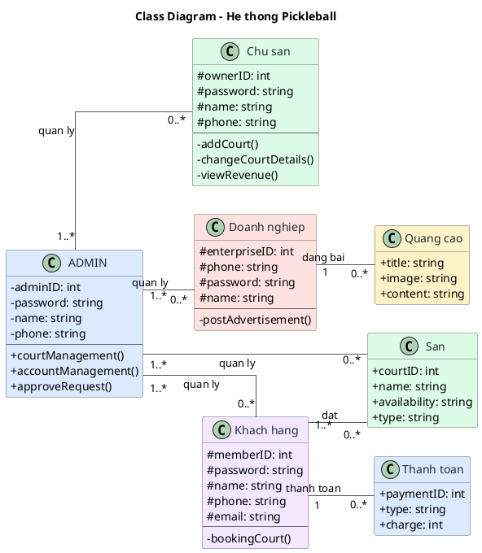

## Class Diagram - Theo Mau Nghiep Vu

```plantuml
@startuml
hide empty members
left to right direction

skinparam shadowing false
skinparam classAttributeIconSize 0
skinparam linetype ortho

skinparam class {
  BorderColor #666666
  ArrowColor #555555
  FontColor #1f2937
  BackgroundColor #ffffff
}

title Class Diagram - He thong Pickleball

' ======================== CLASSES ========================
class "ADMIN" as Admin #dbeafe {
  - adminID: int
  - password: string
  - name: string
  - phone: string
  --
  + courtManagement()
  + accountManagement()
  + approveRequest()
}

class "Chu san" as Owner #dcfce7 {
  # ownerID: int
  # password: string
  # name: string
  # phone: string
  --
  - addCourt()
  - changeCourtDetails()
  - viewRevenue()
}

class "Doanh nghiep" as Enterprise #fee2e2 {
  # enterpriseID: int
  # phone: string
  # password: string
  # name: string
  --
  - postAdvertisement()
}

class "Khach hang" as Customer #f3e8ff {
  # memberID: int
  # password: string
  # name: string
  # phone: string
  # email: string
  --
  - bookingCourt()
}

class "San" as Court #dcfce7 {
  + courtID: int
  + name: string
  + availability: string
  + type: string
}

class "Quang cao" as Advertisement #fef3c7 {
  + title: string
  + image: string
  + content: string
}

class "Thanh toan" as Payment #dbeafe {
  + paymentID: int
  + type: string
  + charge: int
}

' ======================= RELATIONS =======================
Admin "1..*" -- "0..*" Owner : quan ly
Admin "1..*" -- "0..*" Enterprise : quan ly
Admin "1..*" -- "0..*" Customer : quan ly
Admin "1..*" -- "0..*" Court : quan ly

Enterprise "1" -- "0..*" Advertisement : dang bai
Customer "1..*" -- "0..*" Court : dat
Customer "1" -- "0..*" Payment : thanh toan

@enduml
```
