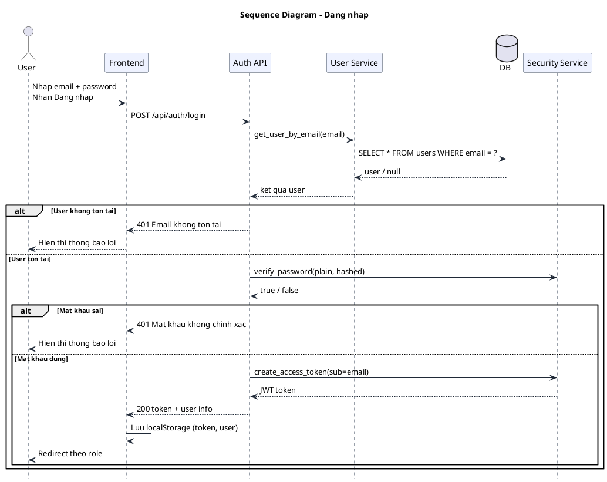
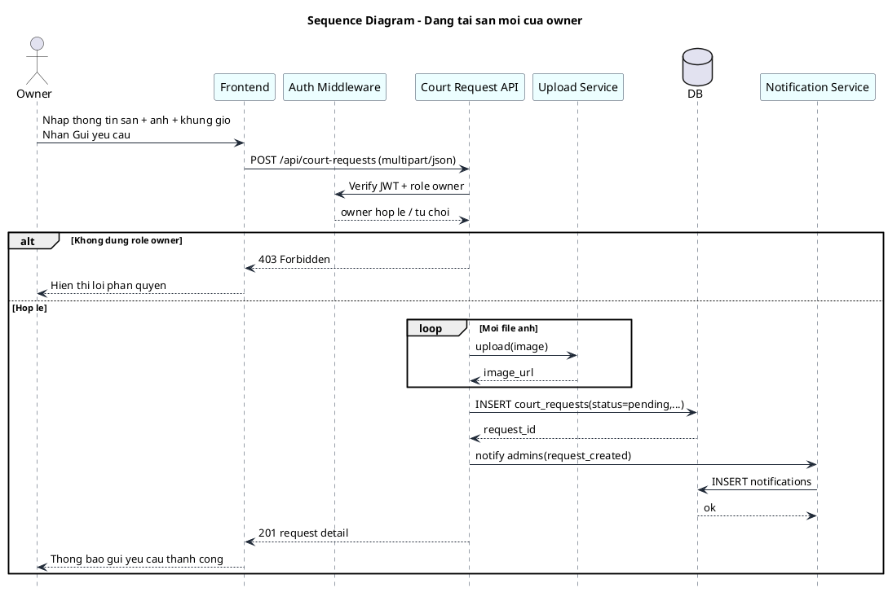
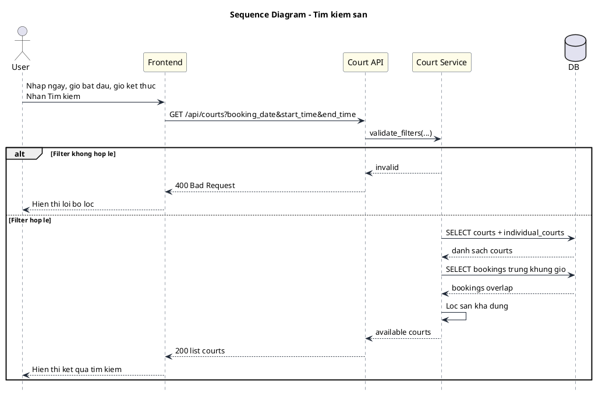
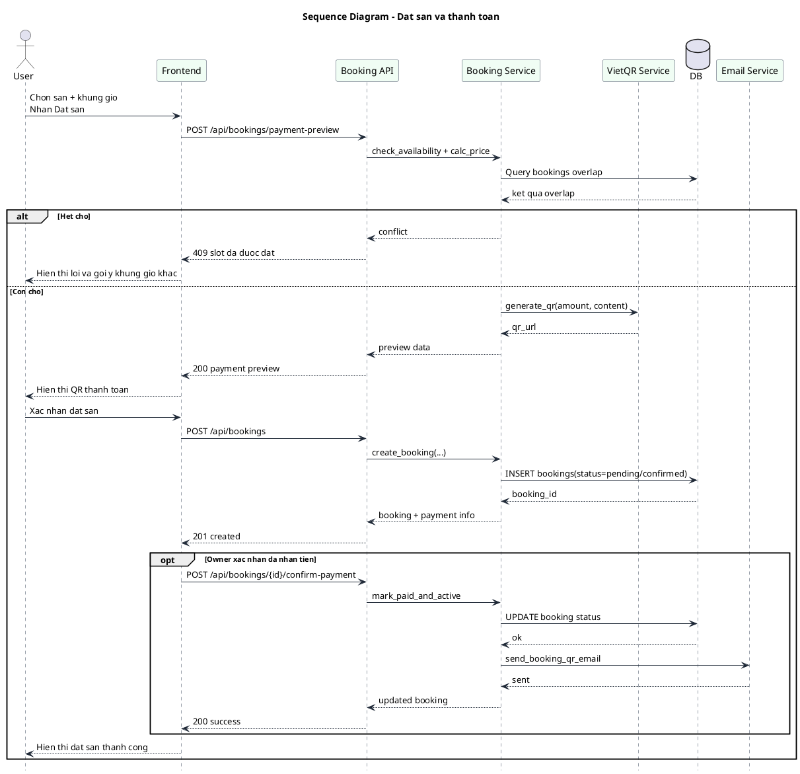
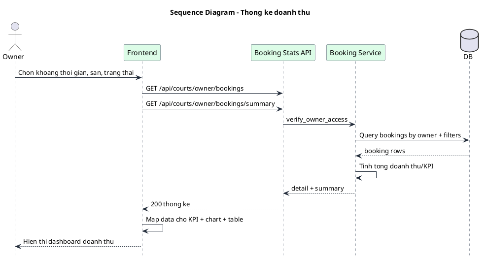
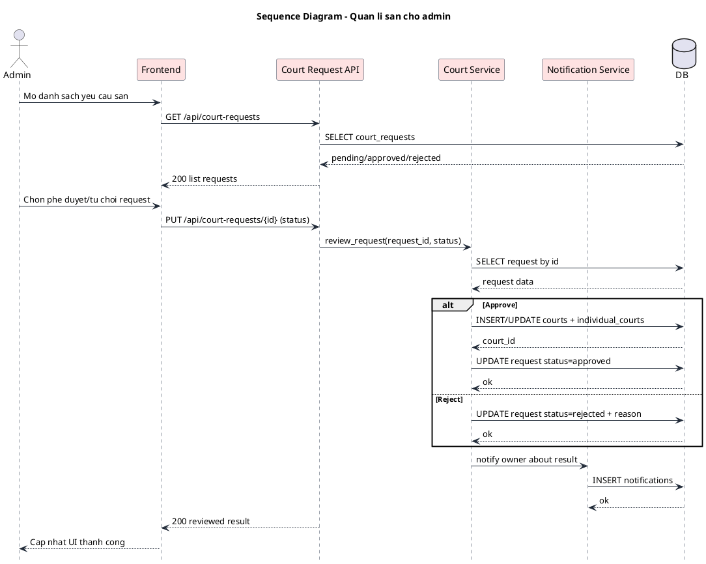
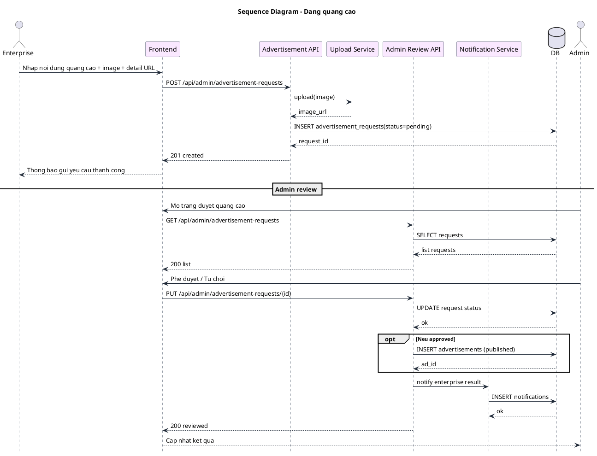

## Sequence Diagram - Dang nhap

---

## Sequence Diagram - Dang tai san moi cua owner

---

## Sequence Diagram - Tim kiem san

---

## Sequence Diagram - Dat san va thanh toan

---

## Sequence Diagram - Thong ke doanh thu

---

## Sequence Diagram - Quan li san cho admin

---

## Sequence Diagram - Dang quang cao

