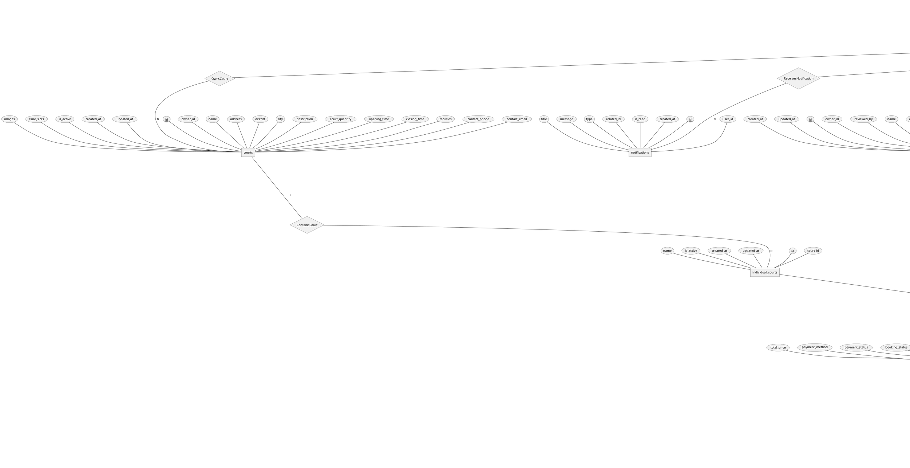

## ERD - PlantUML (Chen Notation)

```plantuml
@startchen

entity users {
	id <<key>>
	email
	hashed_password
	role
	full_name
	phone_number
	avatar_url
	address
	is_active
	bank_account_number
	bank_account_name
	bank_name
	bank_code
	created_at
	updated_at
}

entity courts {
	id <<key>>
	owner_id
	name
	address
	district
	city
	description
	court_quantity
	opening_time
	closing_time
	facilities
	contact_phone
	contact_email
	images
	time_slots
	is_active
	created_at
	updated_at
}

entity individual_courts {
	id <<key>>
	court_id
	name
	is_active
	created_at
	updated_at
}

entity bookings {
	id <<key>>
	individual_court_id
	user_id
	booking_date
	start_time
	end_time
	phone_number
	customer_name
	customer_email
	total_hours
	total_price
	payment_method
	payment_status
	booking_status
	status
	qr_code_url
	bank_transaction_id
	payment_verified_at
	payment_note
	created_at
	updated_at
}

entity booking_invites {
	id <<key>>
	booking_id
	inviter_user_id
	invitee_user_id
	code
	status
	responded_at
	created_at
}

entity notifications {
	id <<key>>
	user_id
	title
	message
	type
	related_id
	is_read
	created_at
}

entity court_requests {
	id <<key>>
	owner_id
	reviewed_by
	name
	address
	district
	city
	description
	court_quantity
	opening_time
	closing_time
	facilities
	contact_phone
	contact_email
	images
	time_slots
	status
	rejection_reason
	reviewed_at
	created_at
	updated_at
}

entity advertisement_requests {
	id <<key>>
	enterprise_id
	reviewed_by
	name
	description
	detail_url
	image_url
	status
	rejection_reason
	reviewed_at
	created_at
	updated_at
}

entity advertisements {
	id <<key>>
	request_id
	enterprise_id
	name
	description
	detail_url
	image_url
	is_active
	published_at
	created_at
	updated_at
}

entity advertisement_clicks {
	id <<key>>
	advertisement_id
	user_id
	ip_address
	user_agent
	created_at
}

entity friend_requests {
	id <<key>>
	sender_id
	receiver_id
	status
	created_at
	responded_at
}

entity friendships {
	id <<key>>
	user_low_id
	user_high_id
	current_streak
	best_streak
	last_activity_at
	created_at
}

relationship OwnsCourt {
}
users -1- OwnsCourt
OwnsCourt -N- courts

relationship ContainsCourt {
}
courts -1- ContainsCourt
ContainsCourt -N- individual_courts

relationship MakesBooking {
}
users -1- MakesBooking
MakesBooking -N- bookings

relationship ForCourtSlot {
}
individual_courts -1- ForCourtSlot
ForCourtSlot -N- bookings

relationship InviteForBooking {
}
bookings -1- InviteForBooking
InviteForBooking -N- booking_invites

relationship SentBy {
}
users -1- SentBy
SentBy -N- booking_invites

relationship SentTo {
}
users -1- SentTo
SentTo -N- booking_invites

relationship ReceivesNotification {
}
users -1- ReceivesNotification
ReceivesNotification -N- notifications

relationship CreatesCourtRequest {
}
users -1- CreatesCourtRequest
CreatesCourtRequest -N- court_requests

relationship ReviewsCourtRequest {
}
users -1- ReviewsCourtRequest
ReviewsCourtRequest -N- court_requests

relationship CreatesAdRequest {
}
users -1- CreatesAdRequest
CreatesAdRequest -N- advertisement_requests

relationship ReviewsAdRequest {
}
users -1- ReviewsAdRequest
ReviewsAdRequest -N- advertisement_requests

relationship PublishesAd {
}
advertisement_requests -1- PublishesAd
PublishesAd -1- advertisements

relationship ClicksAd {
}
advertisements -1- ClicksAd
ClicksAd -N- advertisement_clicks

relationship ClickByUser {
}
users -1- ClickByUser
ClickByUser -N- advertisement_clicks

relationship SendsFriendRequest {
}
users -1- SendsFriendRequest
SendsFriendRequest -N- friend_requests

relationship ReceivesFriendRequest {
}
users -1- ReceivesFriendRequest
ReceivesFriendRequest -N- friend_requests

relationship FriendshipLowUser {
}
users -1- FriendshipLowUser
FriendshipLowUser -N- friendships

relationship FriendshipHighUser {
}
users -1- FriendshipHighUser
FriendshipHighUser -N- friendships

@endchen
```
